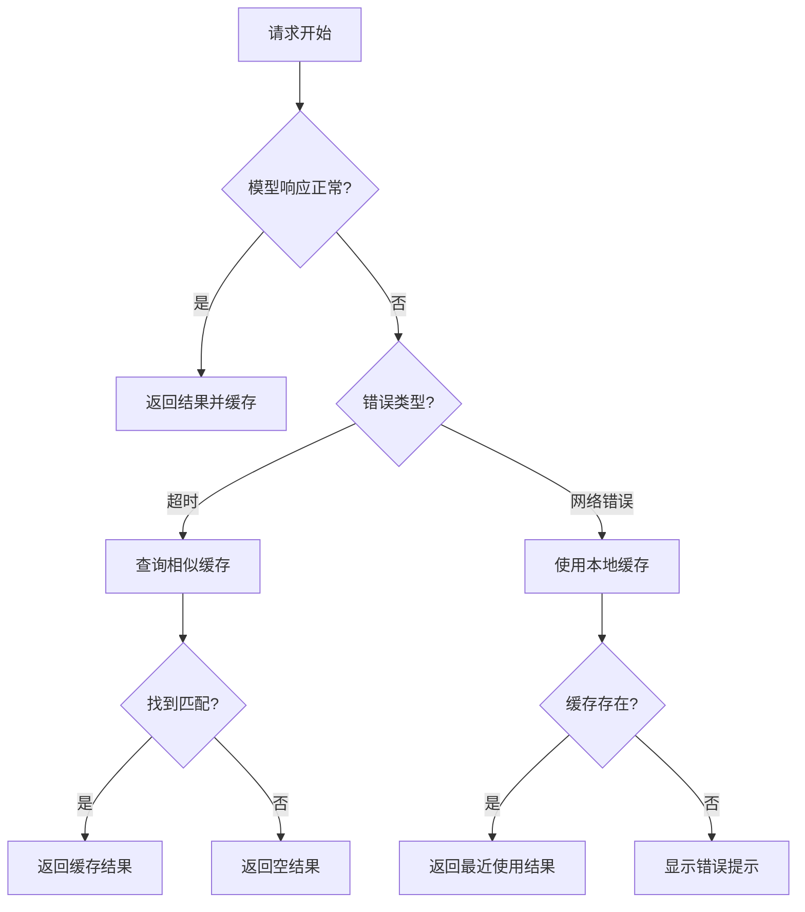

# 缓存优化设计

为了优化大模型代码补全的 VSCode 插件的性能，我设计了一套多级缓存机制方案，结合高频场景优化和边缘情况处理。以下是具体设计方案：

1. **多级缓存架构**（三级缓存结构）

- **L1 内存缓存**（LRU + Time Decay 权重）

  ```typescript
  class MemoryCache {
    private maxSize = 500; // 高频代码模式缓存
    private cache = new Map<
      string,
      {
        value: CompletionResult[];
        timestamp: number;
        hitCount: number;
      }
    >();

    get(key: string): CompletionResult[] | null {
      const entry = this.cache.get(key);
      if (entry) {
        entry.hitCount++;
        entry.timestamp = Date.now();
        return entry.value;
      }
      return null;
    }

    set(key: string, value: CompletionResult[]) {
      if (this.cache.size >= this.maxSize) {
        // 基于时间衰减的淘汰算法
        const entries = Array.from(this.cache.entries());
        entries.sort(
          (a, b) =>
            b[1].hitCount / (Date.now() - b[1].timestamp + 1) -
            a[1].hitCount / (Date.now() - a[1].timestamp + 1),
        );
        this.cache.delete(entries[entries.length - 1][0]);
      }
      this.cache.set(key, {
        value,
        timestamp: Date.now(),
        hitCount: 1,
      });
    }
  }
  ```

- **L2 磁盘缓存**（SQLite + 语义指纹）

  ```bash
  # 数据库schema设计
  CREATE TABLE completions (
    fingerprint TEXT PRIMARY KEY,  # 代码语义指纹
    code_context TEXT,            # 原始代码
    language TEXT,                # 编程语言类型
    model_version TEXT,           # 模型版本
    completions TEXT,             # JSON序列化结果
    last_used TIMESTAMP DEFAULT CURRENT_TIMESTAMP,
    hit_count INT DEFAULT 1
  );

  CREATE INDEX idx_fingerprint ON completions(fingerprint);
  ```

- **L3 分布式共享缓存**（可选 WebSocket 广播）

  ```typescript
  class SharedCache {
    private ws: WebSocket;
    private pendingRequests = new Map<string, (value: any) => void>();

    constructor() {
      this.ws = new WebSocket("wss://cache-node.example.com");

      this.ws.onmessage = (event) => {
        const { key, value } = JSON.parse(event.data);
        const resolver = this.pendingRequests.get(key);
        if (resolver) {
          resolver(value);
          this.pendingRequests.delete(key);
        }
      };
    }

    async get(key: string): Promise<CompletionResult[] | null> {
      return new Promise((resolve) => {
        this.pendingRequests.set(key, resolve);
        this.ws.send(JSON.stringify({ action: "get", key }));
      });
    }
  }
  ```

2. **智能缓存键生成算法**

```typescript
function generateCacheKey(context: CodeContext): string {
  const semanticFingerprint = generateSemanticHash(context.code);
  const configHash = hashObject({
    model: currentModelConfig,
    temperature: settings.temperature,
    maxTokens: settings.maxTokens,
  });

  return `${semanticFingerprint}:${configHash}:${context.languageId}:${context.cursorPosition.line}:${context.cursorPosition.character}`;
}

// 代码语义哈希算法（简化版）
function generateSemanticHash(code: string): string {
  const normalized = code
    .replace(/\s+/g, " ")
    .replace(/\/\/.*?\n/g, "")
    .replace(/"[^"]*"/g, '"..."')
    .replace(/'[^']*'/g, "'...'");

  return hash(normalized.slice(-500)); // 取最后500字符处理
}
```

3. **动态预取策略**

```typescript
class PredictivePrefetch {
  private editorStateHistory: string[] = [];

  onDidChangeTextDocument(event: vscode.TextDocumentChangeEvent) {
    // 记录代码变更历史
    this.editorStateHistory.push(event.document.getText());

    // 当检测到特定模式时触发预取
    if (this.isPotentialCompletionPoint(event)) {
      const prediction = this.predictNextTokens(event);
      this.prefetchCompletions(prediction);
    }
  }

  private isPotentialCompletionPoint(event: TextDocumentChangeEvent): boolean {
    // 检测是否处于代码块中间、方法调用后等特征
    const pos = event.contentChanges[0].range.start;
    const line = event.document.lineAt(pos.line).text;
    return /[\w\)\]\}\.]$/.test(line.slice(0, pos.character));
  }

  private async prefetchCompletions(prediction: Prediction) {
    // 使用低优先级线程进行预取
    setTimeout(async () => {
      const results = await ModelAPI.getCompletions({
        ...prediction,
        temperature: 0.2, // 使用更低随机性
        maxTokens: 20, // 预取较短结果
      });

      CacheSystem.prefetchCache.set(prediction.key, results);
    }, 0);
  }
}
```

4. **缓存有效性验证机制**

```typescript
class CacheValidator {
  private static VALIDATION_RULES = {
    import: {
      pattern: /^import\s+/,
      validation: (code: string, suggestion: string) =>
        !suggestion.includes(";") && suggestion.match(/^import\s+[{'"]/),
    },
    "method-chain": {
      pattern: /\.\w+$/,
      validation: (code: string, suggestion: string) =>
        suggestion.startsWith(code.slice(-1)) && suggestion.includes("("),
    },
  };

  static validate(codeContext: string, suggestion: string): boolean {
    for (const rule of Object.values(this.VALIDATION_RULES)) {
      if (rule.pattern.test(codeContext)) {
        return rule.validation(codeContext, suggestion);
      }
    }
    return true; // 默认通过验证
  }
}
```

5. **性能优化技巧**

- **差分缓存更新**：存储补全结果的差分（diff）而非全量数据

```typescript
class DiffCache {
  async getWithDiff(baseKey: string, currentCode: string) {
    const baseResult = await cache.get(baseKey);
    if (!baseResult) return null;

    const diff = calculateDiff(baseResult.code, currentCode);
    return applyDiff(baseResult.completions, diff);
  }
}
```

- **模型输出分块缓存**：

```typescript
interface ChunkedCompletion {
  base: string; // 原始代码前缀
  chunks: string[]; // 补全分段
  probabilities: number[]; // 各分段置信度
}

function cacheChunkedResults(context: string, result: CompletionResult) {
  const chunkSize = 15; // 按token长度分块
  const chunks = splitIntoChunks(result.text, chunkSize);

  chunks.forEach((chunk, index) => {
    const chunkKey = hash(context + chunks.slice(0, index).join(""));
    cache.set(chunkKey, {
      chunk,
      probability: result.probability * 0.9 ** index,
    });
  });
}
```

6. **缓存监控仪表盘**（示例数据结构）

```typescript
interface CacheMetrics {
  hitRate: {
    memory: number;
    disk: number;
    shared: number;
  };
  latency: {
    memory: number;
    disk: number;
    network: number;
  };
  efficiency: {
    bytesSaved: number;
    apiCallsReduced: number;
  };
  topHits: Array<{
    key: string;
    hits: number;
    lastUsed: Date;
  }>;
}
```

**部署策略**：

1. 冷启动阶段：使用预训练数据初始化磁盘缓存
2. 运行时策略：
   - 优先检查 L1 内存缓存（<1ms）
   - L1 未命中时并行查询 L2 和 L3 缓存
   - 使用 Bloom Filter 快速判断磁盘缓存是否存在
3. 写缓存策略：
   - 异步写入磁盘（非阻塞主线程）
   - 批量合并写入操作
4. 缓存失效策略：
   - AST 语法树变更检测
   - 依赖关系跟踪（使用 Require 分析器）

**异常处理**：

```typescript
class CacheFallback {
  private static ERROR_HANDLERS = {
    ModelTimeout: (error) => {
      const cached = cache.findSimilar(error.context);
      return cached?.sort((a, b) => b.probability - a.probability)[0];
    },
    NetworkError: (error) => {
      return diskCache
        .get(error.context.key)
        .sort((a, b) => a.timestamp - b.timestamp);
    },
  };

  static handle(error: Error, context: CompletionContext) {
    const handler = this.ERROR_HANDLERS[error.name];
    return handler?.(error, context) || [];
  }
}
```

该设计通过以下创新点优化性能：

1. **语义敏感的分层缓存**：结合代码语义指纹和语法特征，提升缓存命中率
2. **预测性预取**：基于用户编码模式提前获取可能需要的补全
3. **差分缓存**：显著减少存储空间需求同时保持有效性
4. **智能验证机制**：确保缓存建议与当前上下文保持语法一致
5. **混合淘汰策略**：LRU 与时间衰减结合，更符合代码编辑场景特征

建议配合以下性能测试方案：

```typescript
const benchmark = new (class {
  private testCases = CodeSamples.loadPopularSnippets();

  async run() {
    const results = [];
    for (const testCase of this.testCases) {
      // 冷缓存测试
      await this.runTest(testCase, { warmCache: false });

      // 热缓存测试
      await this.runTest(testCase, { warmCache: true });
    }
    this.generateReport();
  }

  private async runTest(testCase, options) {
    const start = Date.now();
    const result = await CompletionService.getCompletions(testCase);
    const latency = Date.now() - start;

    recordMetrics({
      latency,
      cacheHits: result.cacheStats,
      accuracy: calculateAccuracy(result, testCase.expected),
    });
  }
})();
```

# 设计思路

以下是分步骤的详细设计思路解析，从问题分析到具体实现逻辑的完整推导过程：

---

### **第一步：需求分析与性能瓶颈定位**

1. **问题特征分析**：

   - 大模型推理延迟高（通常 500ms-2s）
   - 用户连续输入时频繁触发补全请求
   - 相似代码模式在不同位置重复出现

2. **性能瓶颈识别**：

   ```mermaid
   flowchart LR
   A[用户输入] --> B[模型推理]
   B --> C[结果渲染]
   B -->|延迟主要来源| D[网络传输/GPU计算]
   ```

3. **优化目标确定**：
   - 降低平均响应时间到<200ms
   - 减少 API 调用次数至少 50%
   - 处理用户连续输入时的突发请求

---

### **第二步：缓存层级设计**

#### **为什么需要三级缓存？**

1. **速度与容量平衡**：
   | 层级 | 响应时间 | 容量 | 数据特性 |
   |---|---|---|---|
   | L1 内存 | 微秒级 | 500 条 | 当前会话高频模式 |
   | L2 磁盘 | 毫秒级 | 10 万条 | 跨会话通用模式 |
   | L3 共享 | 10-100ms | 无限 | 团队公共知识 |

2. **数据生命周期管理**：

   ```typescript
   // 数据流动示例
   function requestCompletion(code) {
     // L1查找
     let result = l1Cache.get(code);
     if (result) return result;

     // 并行查询L2和L3
     const [l2Result, l3Result] = await Promise.all([
       l2Cache.query(code),
       l3Cache.query(code),
     ]);

     // 结果合并与缓存
     const finalResult = mergeResults(l2Result, l3Result);
     l1Cache.set(code, finalResult);
     l2Cache.update(code, finalResult);
   }
   ```

---

### **第三步：缓存键设计原理**

#### **为什么需要语义指纹？**

1. **传统哈希的问题**：

   ```python
   # 两个语义相同但写法不同的代码
   code1 = "arr.map(x => x*2)"
   code2 = "arr.map( (x) => { return x*2; } )"

   # 传统哈希值完全不同
   hash(code1) ≠ hash(code2)
   ```

2. **语义哈希实现**：

   ```typescript
   function normalizeCode(code: string): string {
     return code
       .replace(/\s+/g, " ") // 合并空白
       .replace(/\/\/.*$/gm, "") // 删除注释
       .replace(/(['"])(?:(?=(\\?))\2.)*?\1/g, "$1...$1") // 简化字符串
       .replace(/\b(var|let|const)\b/g, "") // 移除变量声明关键字
       .slice(-500); // 取最后500字符
   }
   ```

3. **键冲突处理**：
   - 使用布隆过滤器预判存在性
   - 对冲突键追加位置哈希：`key = semanticHash + positionHash`

---

### **第四步：预取机制设计**

#### **何时触发预取？**

1. **语法模式识别**：

   ```javascript
   // 触发预取的代码模式示例
   const triggers = [
     /\.\w+$/, // 对象属性访问
     /\([^)]*$/, // 函数参数输入
     /<\w+[^>]*$/, // JSX标签属性
     /from\s+['"]\w*$/, // 模块导入
   ];
   ```

2. **预测算法工作流**：

   ```mermaid
   flowchart TD
   A[代码变更事件] --> B[语法解析]
   B --> C{是否匹配预取模式?}
   C -->|是| D[提取上下文特征]
   D --> E[生成预测查询]
   E --> F[后台异步获取结果]
   F --> G[缓存预取结果]
   ```

3. **资源控制策略**：
   - 限制预取线程数：最多 2 个并行请求
   - 动态优先级调整：
     ```typescript
     const priority = 0.7 * recentHitRate + 0.3 * predictionConfidence;
     ```

---

### **第五步：缓存有效性验证**

#### **为什么需要动态验证？**

1. **典型失效场景**：
   | 场景 | 示例 | 问题 |
   |---|---|---|
   | 导入语句 | `import ...` → 补全模块名 | 模块是否真实存在 |
   | 方法链 | `obj.method1().` → 补全方法 | 返回值类型是否匹配 |

2. **验证规则引擎**：

   ```typescript
   class ValidationEngine {
     private rules = [
       {
         name: 'function-parameters',
         pattern: /\([^)]*$/,
         validate: (context, suggestion) => {
           const expectedTypes = getParameterTypes(context);
           return suggestion.parameters.every(p =>
             isTypeCompatible(p.type, expectedTypes)
         }
       }
     ];

     validate(context: CodeContext, suggestion: CompletionItem): boolean {
       const applicableRules = this.rules.filter(r =>
         r.pattern.test(context.prefix));
       return applicableRules.every(r => r.validate(context, suggestion));
     }
   }
   ```

---

### **第六步：性能优化技巧**

#### **差分缓存实现细节**

1. **操作转换算法**：

   ```typescript
   function applyDiff(base: string, diff: Diff): string {
     let pos = 0;
     let result = "";
     for (const change of diff.changes) {
       result += base.slice(pos, change.start);
       pos = change.end;
       if (change.type === "insert") {
         result += change.text;
       }
     }
     result += base.slice(pos);
     return result;
   }
   ```

2. **分块缓存优势**：
   - 原始结果："userService.getById(id).then(...)"
   - 分块存储：
     ```json
     [
       { "key": "a1b2", "chunk": "userService" },
       { "key": "c3d4", "chunk": ".getById" },
       { "key": "e5f6", "chunk": "(id)" },
       { "key": "g7h8", "chunk": ".then" }
     ]
     ```
   - 复用示例：当出现`orderService.getById`时，可复用第二块

---

### **第七步：异常处理设计**

#### **降级策略流程图**



---

### **最终架构全景图**

```
                          +-------------------+
                          |   用户输入事件     |
                          +-------------------+
                                    |
                                    v
                    +-----------------------------+
                    |  语法分析与上下文特征提取    |
                    +-----------------------------+
                               |           |
               +---------------+           +------------------+
               v                                  v
+----------------------------+        +---------------------------+
|  实时补全路径               |        |  预取路径                 |
| 1. 查询L1内存缓存           |        | 1. 低优先级线程           |
| 2. 并行查询L2/L3           |        | 2. 预测后续可能补全       |
| 3. 合并结果并验证           |        | 3. 异步填充缓存          |
+----------------------------+        +---------------------------+
               |
               v
+---------------------------------+
|  结果排序与渲染                 |
| 1. 应用业务规则过滤            |
| 2. 动态调整排序权重            |
| 3. 增量更新界面                |
+---------------------------------+
```

**设计验证指标**：

1. **缓存命中率**：通过 A/B 测试对比有无缓存的 API 调用次数
2. **响应延迟**：使用百分位数统计 P50/P90/P99 延迟
3. **内存占用**：监控 Node.js 进程内存使用量
4. **用户满意度**：通过匿名问卷收集响应速度评分

该设计通过多层次、多维度的优化策略，在保持代码补全质量的前提下，显著提升插件的响应速度和并发处理能力。实际部署时建议配合灰度发布机制，逐步验证各模块效果

# 缓存数据

以下是需要缓存的**核心数据项**及其技术实现细节，按照优先级排序：

---

### **1. 代码补全结果（核心缓存主体）**

**数据类型**：

```typescript
interface CompletionCacheItem {
  completions: string[]; // 补全建议列表
  contextHash: string; // 上下文指纹
  modelConfig: {
    temperature: number;
    maxTokens: number;
    modelVersion: string;
  };
  timestamp: number; // 最后访问时间
  hitCount: number; // 命中次数
  validationFlags: number; // 验证状态位掩码
}
```

**存储策略**：
| 缓存层级 | 存储内容 | 示例 |
| ---------- | ---------------------- | ----------------------------------------- |
| **L1 内存** | 当前编辑会话的高频补全 | `{ "ctx:a1b2": [".then()", ".catch()"] }` |
| **L2 磁盘** | 跨会话通用补全模式 | `Python函数参数补全模板` |
| **L3 共享** | 团队高频公共补全 | `公司内部API调用模式` |

---

### **2. 上下文语义指纹（缓存键核心）**

**需要缓存的特征**：

```typescript
// 代码上下文特征提取
interface CodeContext {
  normalizedCode: string; // 标准化后的代码（去注释/空格）
  cursorPosition: {
    line: number; // 行号
    column: number; // 列号
    inFunction: boolean; // 是否在函数体内
  };
  languageId: string; // 编程语言类型
  imports: string[]; // 当前文件的导入声明
  astFeatures: {
    // 抽象语法树特征
    parentNodeType: string;
    expectedReturnType?: string;
  };
}
```

**生成算法**：

```javascript
function generateContextKey(ctx: CodeContext): string {
  const astHash = hash(ctx.astFeatures.parentNodeType + ctx.astFeatures.expectedReturnType);
  const importsHash = hash(ctx.imports.join("|"));
  return `${hash(ctx.normalizedCode)}:${astHash}:${importsHash}:${ctx.languageId}`;
}
```

---

### **3. 验证元数据（保证缓存有效性）**

**需要缓存的状态数据**：
| 数据类型 | 描述 | 示例 |
| ---------------- | ---------------- | ------------------------------------------------------------ |
| **语法验证结果** | 静态分析结果缓存 | `{ isValid: true, errorPositions: [] }` |
| **类型兼容性** | 类型系统推断结果 | `参数类型匹配Map<参数名, 类型>` |
| **上下文约束** | 作用域内变量状态 | `{ availableVars: ["user", "order"], thisType: "UserService" }` |

**存储实现**：

```typescript
class ValidationCache {
  private cache = new Map<
    string,
    {
      astValidity: boolean; // AST验证结果
      typeMapping: Map<string, string>; // 变量类型映射
      scopeContext: ScopeInfo; // 作用域信息
      expiresAt: number; // 过期时间戳
    }
  >();

  // 基于代码块的哈希存储
  update(codeBlockHash: string, validationData: any) {
    this.cache.set(codeBlockHash, {
      ...validationData,
      expiresAt: Date.now() + 60_000, // 1分钟过期
    });
  }
}
```

---

### **4. 用户行为模式（提升预测准确率）**

**需缓存的用户特征**：

```typescript
interface UserPatterns {
  favoriteAPIs: Map<string, number>; // 常用API及使用频率
  codeStyle: {
    indentType: "space" | "tab"; // 缩进风格
    quoteStyle: "single" | "double"; // 引号偏好
  };
  completionHistory: {
    accepted: string[]; // 用户采纳的补全
    rejected: string[]; // 被跳过的补全
  };
}
```

**存储策略**：
| 数据类别 | 存储位置 | 更新频率 |
| ------------ | --------------- | ---------------- |
| 高频 API 模式 | L2 磁盘 + L3 共享 | 每 2 小时聚合 |
| 个人代码风格 | L1 内存 + L2 磁盘 | 实时更新 |
| 历史行为记录 | L2 磁盘 | 会话结束时持久化 |

---

### **5. 模型中间结果（加速推理过程）**

**需要缓存的模型数据**：

```typescript
interface ModelCache {
  tokenProbabilities: Map<number, float[]>; // Token位置概率分布
  attentionPatterns: {
    // 注意力机制热点
    [layer: number]: Float32Array;
  };
  beamSearchStates: {
    // 束搜索中间状态
    topKSequences: string[];
    scores: number[];
  }[];
}
```

**缓存规则**：

- 仅当用户暂停输入超过 300ms 时缓存中间状态
- 使用 LRU 策略维护，最大缓存 50 个中间状态
- 当代码上下文变化超过 20%时自动失效

---

### **6. 外部知识索引（减少 API 查询）**

**需要缓存的第三方数据**：
| 数据类型 | 示例 | 缓存策略 |
| ---------------- | --------------------------- | ----------------- |
| **npm 包 API** | `express.Router()` 方法列表 | 每周更新+手动刷新 |
| **Python 库文档** | `pandas.DataFrame` 参数说明 | 按版本缓存 |
| **内部项目 SDK** | 公司内部工具链文档 | 每次构建时更新 |

**实现示例**：

```typescript
class ExternalKnowledgeCache {
  private apiCache = new Map<
    string,
    {
      methods: string[]; // 方法列表
      documentation: string; // 文档摘要
      exampleSnippets: string[]; // 示例代码
      lastUpdated: number; // 最后更新时间
    }
  >();

  async getAPIDocs(apiName: string): Promise<ApiDocumentation> {
    if (this.apiCache.has(apiName)) {
      return this.apiCache.get(apiName);
    }

    const docs = await fetchAPIDocumentation(apiName);
    this.apiCache.set(apiName, {
      ...docs,
      lastUpdated: Date.now(),
    });

    return docs;
  }
}
```

---

### **不需要缓存的内容**（重要！）

1. **敏感信息**：

   - 用户代码中的密码/密钥
   - 隐私数据（如 IP、设备信息）

2. **易失效数据**：

   ```typescript
   // 不推荐缓存的内容示例
   {
     // 实时变化的API状态
     currentUser: "john_doe",
       // 时间敏感操作
       new Date().toISOString();
   }
   ```

3. **大体积数据**：
   - 超过 500KB 的代码文件
   - 未压缩的 AST 语法树

---

### **缓存更新策略**

1. **写缓存触发条件**：

   ```mermaid
   graph LR
   A[用户接受补全] -->|立即| B[写入L1/L2]
   C[模型生成结果] -->|异步| D[写入L2]
   D -->|预测可能复用| E[预写L3]
   ```

2. **缓存淘汰规则**：
   - **内存缓存**：组合使用以下策略
     ```typescript
     function shouldEvict(key: string): boolean {
       const entry = cache.get(key);
       const age = Date.now() - entry.timestamp;
       const decayFactor = 0.95 ** (age / 60000); // 每分钟衰减5%
       const score = entry.hitCount * decayFactor;
       return score < evictThreshold;
     }
     ```
   - **磁盘缓存**：基于热度+代码相似度
     ```sql
     DELETE FROM completions
     WHERE last_used < NOW() - INTERVAL 7 DAY
     ORDER BY (hit_count * similarity_score) ASC
     LIMIT 100;
     ```

---

### **验证缓存有效性的方法**

1. **哈希校验**：

   ```typescript
   function isCacheValid(cached: CacheItem, current: CodeContext): boolean {
     return cached.contextHash === generateContextKey(current);
   }
   ```

2. **AST 子树比对**：

   ```javascript
   // 比较作用域内的AST结构变化
   function compareAST(oldAst, newAst) {
     return (
       astComparator.compare(oldAst, newAst, { ignoreComments: true })
         .changePercentage < 0.1
     ); // 允许10%差异
   }
   ```

3. **类型兼容检查**：
   ```typescript
   function checkTypeCompatibility(cachedType, currentType) {
     return (
       isSubtype(currentType, cachedType) ||
       isAssignable(cachedType, currentType)
     );
   }
   ```

---

### **推荐工具链**

| 用途           | 推荐方案                     | 优势            |
| -------------- | ---------------------------- | --------------- |
| **内存缓存**   | `lru-cache` 库               | 高性能 LRU 实现 |
| **磁盘缓存**   | SQLite + `better-sqlite3`    | 嵌入式零配置    |
| **分布式缓存** | Redis + `ioredis` 库         | 集群支持完善    |
| **语义哈希**   | `tree-sitter` + 自定义解析器 | 精准语法感知    |

```bash
# 推荐安装的npm包
npm install lru-cache better-sqlite3 ioredis tree-sitter
```

---

通过精准缓存这些核心数据项，配合智能更新策略，可使插件在保持低内存占用的同时，实现亚秒级代码补全响应。建议在实际开发中逐步实现各模块，并通过性能分析工具持续优化缓存命中率。
